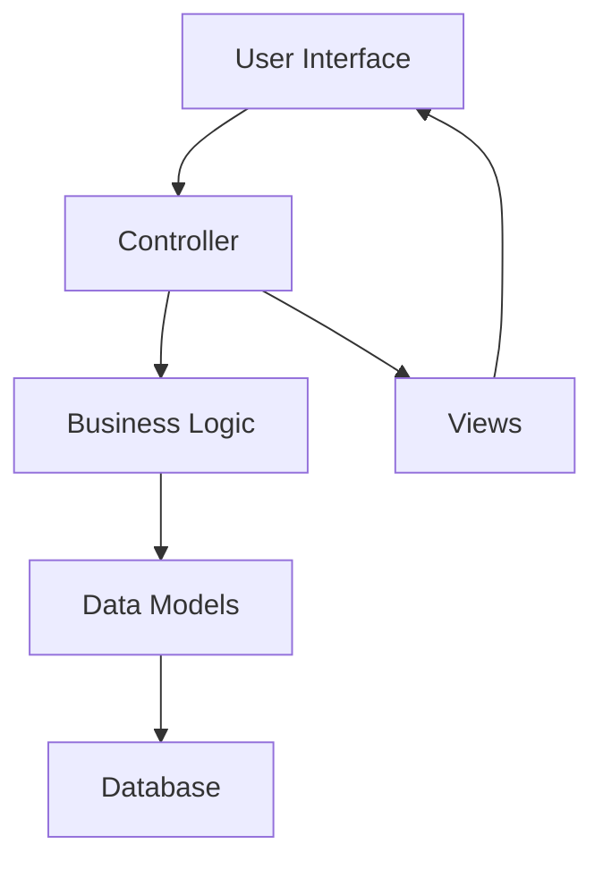

# 💰 Expense Tracker

> **Take Control of Your Finances** - A powerful, intuitive web application that transforms how you track, analyze, and optimize your spending habits.

[](https://dotnet.microsoft.com/apps/aspnet)
[](https://docs.microsoft.com/en-us/ef/)
[](https://getbootstrap.com/)
[](https://www.microsoft.com/en-us/sql-server)

---

## 🌟 Why Choose Expense Tracker?

Transform your financial management with a **beautifully designed, feature-rich expense tracking solution**. Whether you're managing personal finances or business expenses, our application provides the insights and tools you need to make informed financial decisions.

### 🎯 What Sets Us Apart

- 📊 **Visual Financial Insights** - Interactive dashboards that reveal spending patterns
- 🏷️ **Smart Categorization** - Organize expenses with custom categories and icons
- 📱 **Mobile-Responsive Design** - Track expenses seamlessly on any device
- ⚡ **Real-Time Analytics** - Instant updates and live financial summaries
- 🔒 **Data Security** - Robust validation and secure data handling
- 🎨 **Modern UI/UX** - Clean, professional interface designed for productivity

---

## 🚀 Key Features That Empower Your Financial Journey

### 💳 **Comprehensive Transaction Management**
- ✅ **Full CRUD Operations** - Create, view, edit, and delete transactions effortlessly
- 📈 **Income & Expense Tracking** - Categorize every transaction with precision
- 📅 **Date-Based Organization** - Track expenses by date with filtering options
- 📝 **Detailed Notes** - Add context to every transaction
- 🔍 **Advanced Search** - Find transactions quickly with powerful filtering

### 🏷️ **Intelligent Category System**
- 🎨 **Custom Categories** - Create personalized expense categories with icons
- 📊 **Category Analytics** - See spending breakdown by category
- 🔧 **Flexible Management** - Edit, delete, or reorganize categories anytime
- 🎯 **Income vs Expense** - Clear distinction between income and expense categories

### 📊 **Powerful Dashboard & Analytics**
- 📈 **Visual Charts** - Interactive graphs showing income vs expenses
- 🥧 **Category Breakdown** - Pie charts revealing spending patterns
- 📋 **Recent Activity** - Quick overview of latest transactions
- 💡 **Financial Insights** - Actionable summaries and recommendations
- 🎯 **Spending Trends** - Identify patterns and optimize your budget

### 🎨 **Modern User Experience**
- 📱 **Responsive Design** - Perfect experience on desktop, tablet, and mobile
- 🎭 **Interactive Navigation** - Smooth sidebar with intuitive menu structure
- ⚡ **Fast Performance** - Optimized for speed and efficiency
- 🌟 **Professional Aesthetics** - Clean, modern design with attention to detail

---

## 🛠️ Technology Stack

### **Robust Backend Architecture**
```
🏗️ ASP.NET Core MVC        → Enterprise-grade web framework
🗄️ Entity Framework Core   → Modern ORM with Code-First approach
🔷 C#                      → Type-safe, powerful programming language
🗃️ SQL Server             → Reliable, scalable database solution
```

### **Modern Frontend Experience**
```
🎨 Razor Views             → Dynamic, server-rendered pages
🎯 Bootstrap 5             → Responsive, mobile-first design
⚡ JavaScript/jQuery       → Interactive client-side functionality
🎭 CSS3                    → Custom animations and modern styling
```

### **Development Excellence**
```
🔧 Visual Studio           → Professional IDE with IntelliSense
📊 Git Version Control     → Collaborative development workflow
🔄 EF Core Migrations      → Database schema version control
```

---

## 🏗️ Architecture & Design Patterns

### **MVC Architecture Benefits**


### **Best Practices Implemented**
- 🏛️ **Clean Architecture** - Separation of concerns for maintainability
- 🔄 **Repository Pattern** - Abstracted data access layer
- 💉 **Dependency Injection** - Loose coupling and testability
- 📱 **Responsive Design** - Mobile-first approach
- 🗄️ **Code-First Database** - Version-controlled schema evolution
- 🛡️ **Robust Error Handling** - Graceful error management
- 📚 **Modular Structure** - Organized, maintainable codebase

---

## 📊 Data Models & Structure

### **Category Model**
```csharp
🏷️ Title        → Category name (e.g., "Food & Dining")
🎨 Icon         → Visual identifier for quick recognition
📊 Type         → Income or Expense classification
```

### **Transaction Model**
```csharp
🏷️ Category     → Foreign key linking to category
💰 Amount       → Transaction value
📝 Description  → Detailed notes and context
📅 Date         → When the transaction occurred
📊 Type         → Income or Expense indicator
```

---

## 🎯 Getting Started

### **Prerequisites**
- ✅ **.NET 6.0 SDK** or higher
- ✅ **SQL Server** (LocalDB supported)
- ✅ **Visual Studio 2022** (recommended)

### **Quick Setup**
```bash
# Clone the repository
git clone [your-repo-url]
cd expense-tracker

# Restore dependencies
dotnet restore

# Update database with migrations
dotnet ef database update

# Run the application
dotnet run
```

### **Configuration**
Update `appsettings.json` with your database connection:
```json
{
  "ConnectionStrings": {
    "DefaultConnection": "Server=(localdb)\\mssqllocaldb;Database=ExpenseTracker;Trusted_Connection=true;"
  }
}
```

---

## 🌟 Feature Showcase

### **Dashboard Overview**
- 📊 **Real-time Metrics** - Live income/expense totals
- 📈 **Trend Analysis** - Visual spending patterns
- 🏆 **Top Categories** - Biggest expense categories
- 📅 **Recent Activity** - Latest transactions at a glance

### **Transaction Management**
- ➕ **Quick Add** - Streamlined transaction entry
- 🔍 **Smart Filtering** - Find transactions by date, category, or amount
- ✏️ **Inline Editing** - Modify transactions without page reload
- 🗑️ **Bulk Operations** - Delete multiple transactions efficiently

### **Category Intelligence**
- 🎨 **Icon Library** - Choose from hundreds of category icons
- 📊 **Usage Analytics** - See which categories are used most
- 🔄 **Category Migration** - Move transactions between categories
- 📈 **Spending Insights** - Category-based financial analysis

---


## 💪 Skills Demonstrated

This project showcases expertise in:

### **Full-Stack Development**
- 🏗️ **Backend Architecture** - ASP.NET Core MVC mastery
- 🎨 **Frontend Design** - Responsive UI/UX development
- 🗄️ **Database Design** - Efficient data modeling and relationships

### **Modern Development Practices**
- 🏛️ **Clean Architecture** - SOLID principles and design patterns
- 🔄 **Version Control** - Git workflow and collaboration
- 🧪 **Problem Solving** - Complex business logic implementation
- 📱 **Responsive Design** - Cross-platform compatibility

### **Professional Software Development**
- 🔧 **Code Quality** - Maintainable, scalable code structure
- 🛡️ **Security Awareness** - Data validation and protection
- 📊 **Performance Optimization** - Efficient query design
- 🎯 **User Experience** - Intuitive interface design

---

## 🎨 Design Philosophy

**"Simplicity is the ultimate sophistication"** - Our design philosophy centers on creating a powerful yet intuitive experience that doesn't overwhelm users with complexity.

### **Core Design Principles**
- 🎯 **User-Centric** - Every feature designed with user needs in mind
- ⚡ **Performance First** - Fast, responsive interactions
- 📱 **Mobile-Friendly** - Seamless experience across all devices
- 🎨 **Visual Clarity** - Clean, professional aesthetic
- 🔄 **Consistent** - Unified design language throughout

---


Dashboard:


List Of Categories:


Adding Page of New Category:


List of Transaction:


Adding New Transaction:


Categories Populated in Transaction Form as Dropdown list to Select Transactions Category Type


